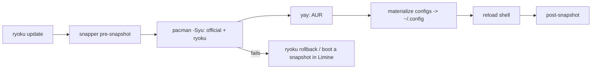

<div align="center">

# 力 Ryoku Arch

**A hand-built Arch Linux distribution: one cohesive Hyprland desktop, an installer, and the system that reproduces it, all from a single repository.**

[](https://github.com/neur0map/ryoku-arch/releases)
[](https://archlinux.org)
[](https://hypr.land)
[](LICENSE)

[Install](#install) - [Update](#update) - [How it fits](#how-it-fits) - [For maintainers](#for-maintainers)

</div>

---

Ryoku (力, "power") is not a config dump. It is a complete, opinionated desktop
plus the installer and system definition that put it on any machine. The repo is
the single source of truth; a live machine is only ever a deployment target.

## Why Ryoku

- **One desktop, one motion language.** The bar, panels, launcher, lock screen,
  notifications, and screenshot tool are a single morphing shell (the *pill* and
  its islands), not a pile of unrelated widgets.
- **Works on day one.** Sensible defaults that are usable immediately. Developer
  toolchains and their package managers work without root; theming follows the
  wallpaper; the GPU, displays, and laptop power are detected and configured.
- **Reproducible.** A fresh install reaches the exact desktop the repo describes.
- **Safe to update.** Every update is a Btrfs snapshot away from a clean
  rollback you can boot into from the loader.
- **Minimal and legible.** No cruft, no dead code, no duplicated config. Small,
  focused files you can actually read.

## Install

1. Download the signed ISO from **[iso.ryoku.dev](https://iso.ryoku.dev)**.
2. Verify it against the Ryoku release key:
   ```sh
   gpg --import keys/ryoku-release-key.pub.asc   # fingerprint EB6D 3C0F 55A7 B3CA BA6B  2838 847B 274F 025D D6E3
   gpg --verify ryoku-*.iso.sig ryoku-*.iso
   ```
3. Write it to a USB stick and boot it.
4. Run the guided TUI installer. It partitions (Btrfs with subvolumes), pacstraps
   the package set, sets up the Limine boot chain, installs the Ryoku desktop
   from the signed `[ryoku]` repository, and configures snapshots.

## Update

Everything updates through one command:

```sh
ryoku update      # snapshot -> pacman -Syu (+ AUR) -> apply desktop -> reload, with rollback if it fails
```



- **Signed.** The desktop ships from the `[ryoku]` pacman repo, signed by the
  release key and trusted via `ryoku-keyring`.
- **Your settings survive.** Base configs are owned by Ryoku and refreshed in
  place; your edits live in untouched override files (`hypr/user.lua`,
  `kitty/user.conf`, `fish/user.fish`) that load last and win.
- **No migration scripts.** Updates are declarative: configs are re-materialized,
  packages resolve through pacman, and the rare imperative change rides in the
  package that owns it. Roll back with `ryoku rollback` or pick the prior
  snapshot in the Limine menu.

## How it fits

| Path | One job |
|---|---|
| `ryoku/` | The desktop: the Hyprland (Lua) config, the Quickshell UI (pill, hub, lockscreen), app configs, brand assets. |
| `system/` | The machine definition: boot chain, hardware policy, package sets. |
| `installation/` | How a machine is built: the Go TUI, the backend installer, the ISO profile. |
| `release/` | Packaging: the desktop PKGBUILDs, the `[ryoku]` repo builder, the signing keyring. |
| `docs/` | The guides. Start with `docs/ryoku.md` and `docs/structure.md`. |

The control plane is a single Go daemon (`ryoku-shell`); the `ryoku` CLI is the
front door to updates, rollback, and the shell.

## For maintainers

- **`main`** is the stable channel everyone runs, published to `[ryoku]` and the
  ISO only on tagged releases.
- **`unstable-dev`** is the maintainer preview, consumed through the dev loop
  (`ryoku/shell/dev-run.sh`), and is **never** published. Releases are batched
  promotions from `unstable-dev` to `main`.

See `docs/development.md` for the deploy/test/commit loop and the git gates.

## Credits & license

Ryoku began as an Omarchy-derived environment and stands on the shoulders of
several open shells; see [`NOTICE`](NOTICE) for the full attribution. Released
under the [GNU GPL v3](LICENSE).

<div align="center"><sub>力 built from one source of truth.</sub></div>
