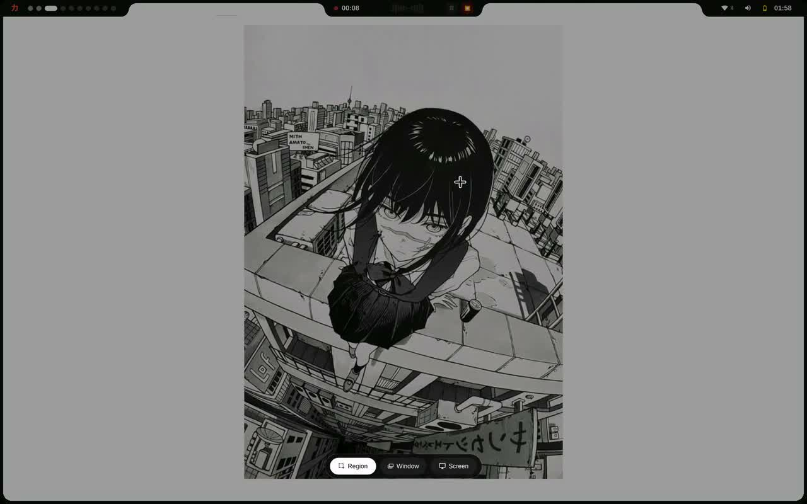

# Ryoku Arch

**力と美のために** &middot; *For the sake of power and beauty.*

Ryoku is an opinionated Arch desktop built around Niri and Quickshell. A daily-driver cybersecurity workstation, not a VM.

<kbd>[Vision](docs/vision.md)</kbd> &middot; <kbd>[Docs](docs/)</kbd> &middot; <kbd>[Customize](docs/customization-inventory.md)</kbd> &middot; <kbd>[Keybindings](docs/keybindings.md)</kbd>

  
   
  <a href="docs/media/showcase.mp4"><strong>Watch the showcase</strong></a>

---

## About

Most security distributions assume you'll run them in a VM and switch back to your real OS to get work done. Ryoku is the other approach: an Arch system you actually live in. Steam, Discord, your IDE, your bank's awful Java applet, the engagement VPN, your THM lab, all on the same machine.

The desktop is Niri, a scrollable-tiling Wayland compositor, with a Quickshell-based topbar, sidebars, lock screen, and settings panel. Workflow primitives that matter to security work are built into the shell instead of bolted on as separate tray icons: a sidebar tab for OpenVPN profile management, a SecPulse indicator that tracks Tailscale and OpenVPN at a glance, an in-shell polkit agent for clean privilege escalation. The boot, lock, login, and desktop surfaces share one visual language.

Ryoku descends from omarchy and inherits its install-script architecture, theme pipeline, and command shape. The Arch base, the package selection, and the security-tooling track diverge.

## What ships

- **Desktop**: Niri scrollable-tiling Wayland session, Quickshell topbar / sidebars / lock / launcher / settings, SDDM with switchable themes.
- **Security primitives**: in-shell OpenVPN profile manager, Tailscale + OpenVPN bar indicators, hardened defaults (UFW, encrypted home, no telemetry phoning home).
- **Daily-driver fit**: Steam, Discord, dev toolchains (mise, Docker, common languages), media stack (mpv, browsers, image / video tools).
- **Brand**: cohesive Greek-Noir palette, custom topbar layouts, Material 3 system with switchable skins (`material`, `aurora`, `angel`, `ryoku-shell`, `cards`).

## Status

Public preview. The first signed ISO release is still pending.

The Niri source transition has landed. The next ISO build, boot verification on the working hardware matrix, and the curated security-tooling baseline are the gating items before a tagged release. The repo is open for review in the meantime; development happens on `main`.

| Question | Answer |
|---|---|
| Is the ISO downloadable? | Not yet. Build locally with `iso/builder/build-iso.sh` if you want to try. |
| NVIDIA, hybrid, AMD, Apple Silicon? | All targeted. Working hardware list and driver matrix in [`docs/iso-build-recipe.md`](docs/iso-build-recipe.md). |
| Does it bundle every pentest tool? | No. A curated track is being assembled; opt-in metas planned. Out of the box you get the desktop, not the toolbox. |
| Secure Boot? | Roadmap. Not automatic yet. |
| Stability vs. rolling Arch? | Rolling. A `ryoku-stable` branch lagging behind known-good snapshots is on the roadmap. |

## Browse the repo

- `bin/` shipped `ryoku-*` commands (one purpose per script).
- `config/` Niri / kitty / waybar / app configs as installed.
- `default/` theme assets, polkit rules, systemd drop-ins.
- `install/` install pipeline (`config/all.sh`, `packaging/aur-core.sh`, hardware detection).
- `shell/` the Quickshell desktop sources.

## Documentation

- [**Vision**](docs/vision.md) what Ryoku is, who it is for, what it is not.
- [**Keybindings**](docs/keybindings.md) shipped Niri and shell reference.
- [**Maintenance**](docs/maintenance.md) release process and workflow.
- [**Customization**](docs/customization-inventory.md) safe text-based customization surfaces.
- [**Branding**](docs/branding.md) visual and verbal identity.
- [**ISO build recipe**](docs/iso-build-recipe.md) end-to-end build and the working hardware matrix.
- [**Omarchy heritage**](docs/omarchy-heritage.md) what remains from upstream and why.
- [**Contributing**](CONTRIBUTING.md) focused ways to help.
- [**Security policy**](SECURITY.md) private reporting for security-sensitive issues.

## Acknowledgements

- [**iNiR**](https://github.com/snowarch/iNiR), the upstream Quickshell shell layer Ryoku ships on top of Niri.
- [**Omarchy**](https://github.com/basecamp/omarchy) by DHH, the install architecture, command shape, and theme pipeline.
- [**qylock**](https://github.com/Darkkal44/qylock) by Darkkal44, optional SDDM theme bundle.

Full attribution: [`CREDITS.md`](CREDITS.md), [`NOTICE`](NOTICE).

## License

[MIT](LICENSE).
