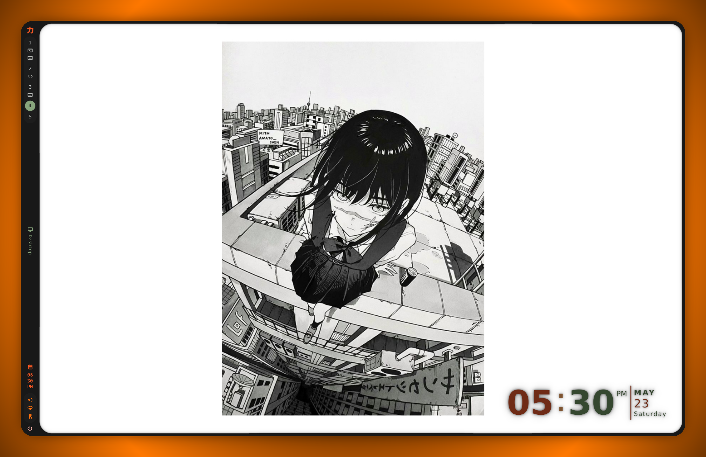

# Ryoku Arch

**力と美のために** &middot; *For the sake of power and beauty.*

Ryoku is a premium Arch workstation for powerful desktops and laptops. It is
pre-riced, plugin-minded, and built for people who want their Linux machine to
feel fast, sharp, and deliberate from first boot.

<kbd>[Vision](docs/vision.md)</kbd> &middot; <kbd>[Docs](docs/)</kbd> &middot; <kbd>[Customize](docs/customization-inventory.md)</kbd> &middot; <kbd>[Keybindings](docs/keybindings.md)</kbd> &middot; <kbd>[Discord](https://discord.gg/8KjBmUEyKA)</kbd> &middot; <kbd>[Subreddit](https://www.reddit.com/r/RyokuArch/)</kbd>

  

---

## About

Ryoku is not trying to be the lightest Arch setup in the room. It takes the
other lane: a polished workstation that assumes the machine has room to breathe.
The target is a strong desktop or laptop, not a budget box that needs every
megabyte saved.

The current desktop is Hyprland with a Quickshell shell layer. The install and
core command shape still descend from Omarchy, and the shell is being shaped
from Celestia while Ryoku grows its own plugin-first shell. That is intentional
for now: take the useful base, make the product coherent, then replace borrowed
parts as Ryoku-owned surfaces mature.

The goal is simple: power and beauty in the same system. Fast windowing, a
strict command surface, good defaults, strong visual identity, and plugins that
add real workstation behavior instead of turning the desktop into a pile of
loose tray apps.

## Position

Omarchy is a lean, opinionated Arch install that can fit modest laptops well.
Ryoku is the opposite side of that family tree: heavier, more visual, more
integrated, and aimed at capable hardware.

Ryoku is:

- **Premium Arch, not a separate distro.** It is an Arch environment with its
  own defaults, install flow, shell, commands, and branding.
- **Pre-riced by default.** The first boot should already feel intentional.
- **Plugin-minded.** VPN, capture, media, developer, hardware, and security
  operations can become clean Ryoku plugins and shell surfaces.
- **Built for powerful desktops and laptops.** The baseline is 16GB RAM or
  better; 32GB+ is the comfortable target for VMs, gaming, creative tools, and
  heavy multitasking.

Ryoku is not:

- A budget-PC profile.
- A minimal window-manager starter kit.
- A narrow, niche-focused workflow profile.
- A promise that every borrowed Omarchy or Celestia piece is final.

## What ships

- **Desktop:** Hyprland Wayland session, Quickshell/Celestia-derived shell
  surfaces, launcher, sidebars, dashboard, session controls, and SDDM theming.
- **Ryoku core:** `ryoku-*` commands for updates, migrations, packages,
  snapshots, hardware helpers, themes, wallpaper, keybinds, and app launchers.
- **Plugin lanes:** shell and command hooks for VPN, Tailscale, screenshots,
  media, developer tools, hardware controls, and future workflow modules.
- **Workstation defaults:** Kitty, Helium/Chromium, Nautilus, Yazi, Neovim,
  Obsidian, Docker tooling, media tools, gaming-ready packages, and AUR-backed
  extras.
- **Brand:** Greek Noir, the Ryoku `力` mark, and the slogan:
  **力と美のために** - *For the sake of power and beauty.*

## Status

Public preview. Signed alpha ISOs are downloadable; the first tagged stable
release is still ahead.

The active workstation track is Hyprland. Development happens on
`unstable-dev`, then stabilizes into `main` for release users. The shell is in
transition: Ryoku is using Omarchy install/core ancestry and Celestia shell
ideas while the Ryoku-owned plugin shell takes shape.

| Question | Answer |
|---|---|
| Minimum RAM | **16GB+ required.** Use **32GB+** if you expect VMs, gaming, browser-heavy work, or creative tools. This is not a low-resource target. |
| Target hardware | Modern desktops and stronger laptops. NVIDIA, hybrid, AMD, and Intel graphics are target classes. |
| Is the ISO downloadable? | Yes, from the [Ryoku website](https://ryoku.dev). See [Download and verify](#download-and-verify). |
| Is every bundled plugin lane installed by default? | No. Ryoku ships core productivity lanes and extras as optional add-ons. |
| Secure Boot? | Roadmap. Not automatic yet. |
| Stability vs. rolling Arch? | Rolling Arch base. `unstable-dev` is the fast track; `main` is the release channel. |

## Download and verify

Signed alpha builds are published on the website at `https://ryoku.dev`. Use the
Download page to get the latest ISO, signature, and checksums.

Releases are signed with:

- **Key:** `Ryoku Releases <releases@ryoku.dev>`
- **Fingerprint:** `621F 579B D155 94C4 DE84  0B7D 5329 7813 C0BE E055`
- **Public key in repo:** [`keys/ryoku-release-key.pub.asc`](keys/ryoku-release-key.pub.asc)

Always check that the imported key's fingerprint matches the one above before
trusting it. Full verification commands are in
[`docs/release-pipeline.md`](docs/release-pipeline.md).

## Browse the repo

- `bin/` shipped `ryoku-*` commands, one purpose per script.
- `config/` Hyprland, terminal, app, and user config seeds.
- `default/` system defaults, templates, boot assets, and service drop-ins.
- `install/` installer, package manifests, hardware setup, and first-run flow.
- `shell/` the current Quickshell/Celestia-derived shell sources.
- `themes/` Ryoku and user-selectable theme payloads.

## Documentation

- [**Vision**](docs/vision.md) product direction, audience, non-goals.
- [**Keybindings**](docs/keybindings.md) shipped Hyprland and shell reference.
- [**Plugins**](docs/plugins.mdx) current and planned workflow plugins.
- [**Maintenance**](docs/maintenance.md) release process and workflow.
- [**Customization**](docs/customization-inventory.md) safe text-based customization surfaces.
- [**Branding**](docs/branding.md) visual and verbal identity.
- [**ISO build recipe**](docs/iso-build-recipe.md) build recipe and hardware notes.
- [**Heritage**](docs/omarchy-heritage.md) Omarchy and Celestia inheritance.
- [**Contributing**](CONTRIBUTING.md) focused ways to help.
- [**Security policy**](SECURITY.md) private reporting for security-sensitive issues.

## Acknowledgements

- [**Omarchy**](https://github.com/basecamp/omarchy) by DHH, for the install
  architecture, command shape, and early Arch desktop foundation.
- [**Celestia Shell**](https://github.com/caelestia-dots/shell), for the shell
  ideas Ryoku is currently adapting while its own shell direction matures.
- [**ActivSpot**](https://github.com/Devvvmn/ActivSpot) by Devvvmn, for Dynamic
  Island code adapted into Ryoku's island work and launcher/island inspiration.
- [**qylock**](https://github.com/Darkkal44/qylock) by Darkkal44, optional SDDM
  theme bundle.

Full attribution: [`CREDITS.md`](CREDITS.md), [`NOTICE`](NOTICE).

## License

[GPL-3.0](LICENSE). MIT notices for inherited permissive components are
preserved under [LICENSES](LICENSES/).
