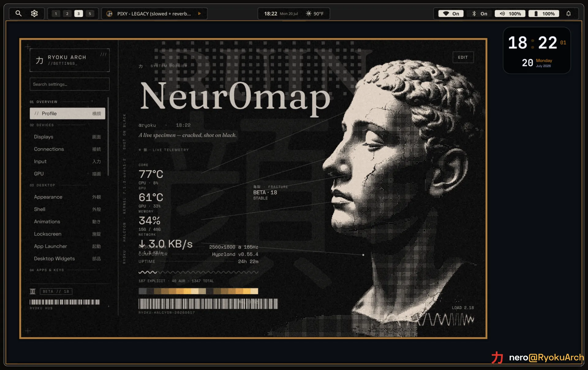
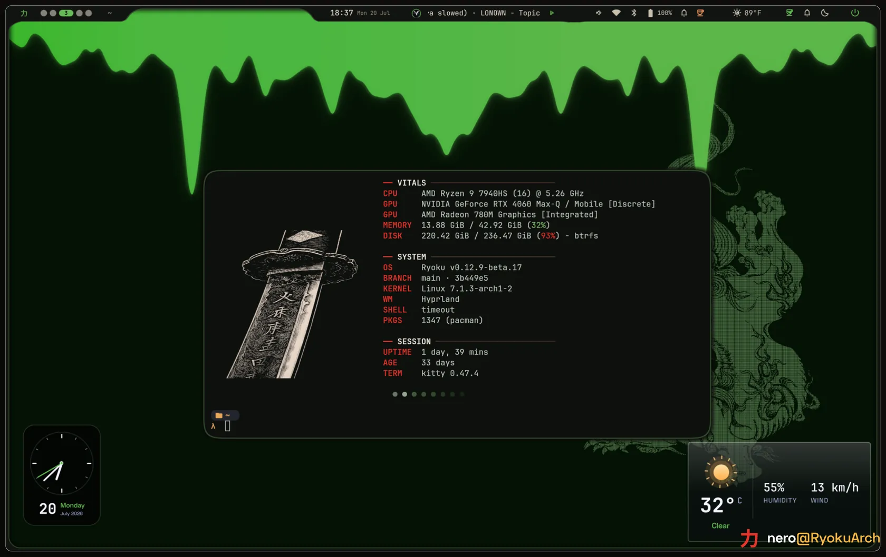
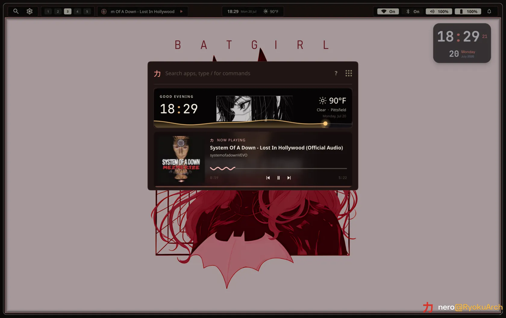
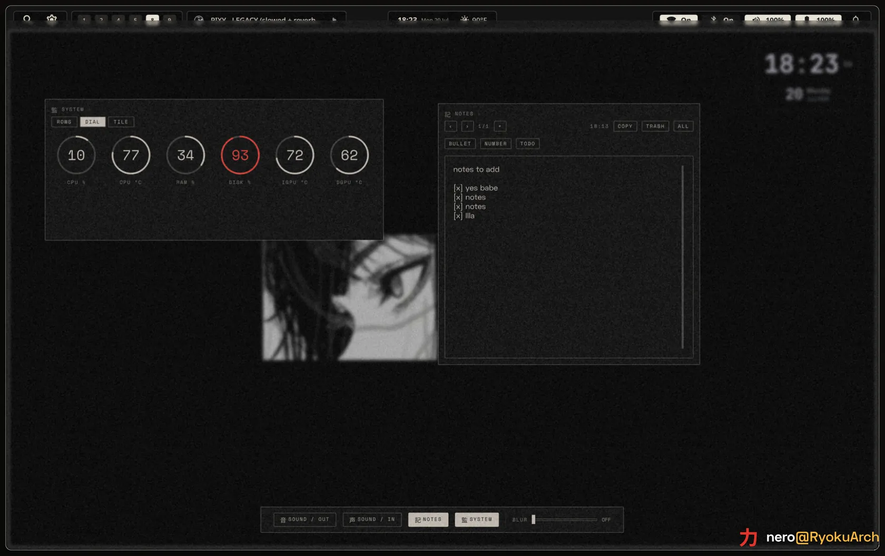
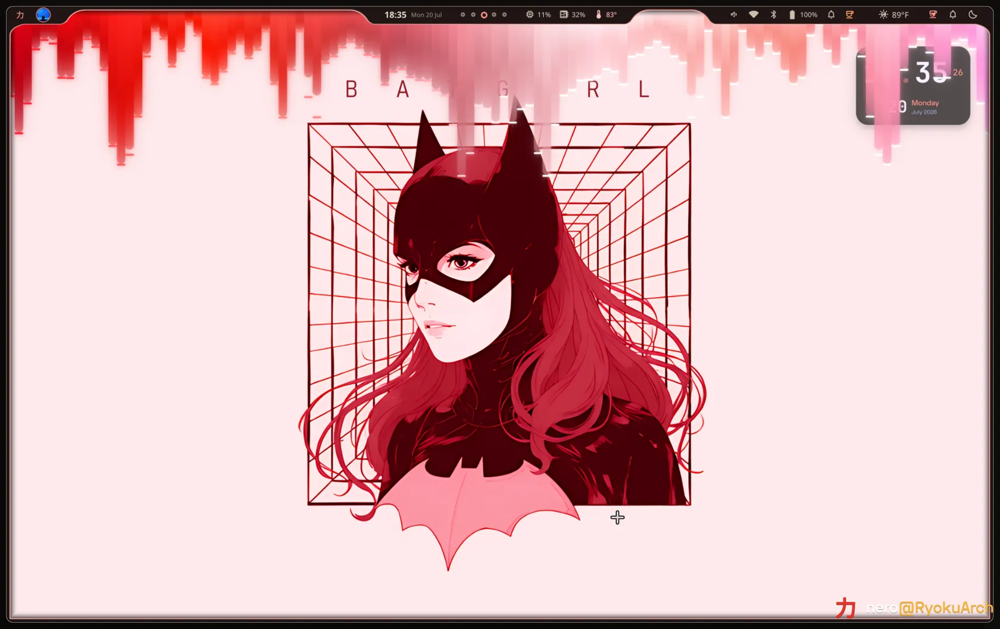

<div align="center">


# Ryoku Arch

**力と美のために** &middot; *For the sake of power and beauty.*

Ryoku is a hand-built Arch Linux distribution: one cohesive Hyprland desktop, a
guided installer, and the system definition that reproduces them, all from a
single repository. The base is lean enough to live in from first boot and
deliberate in how it looks and moves.

[](LICENSE)
[](https://archlinux.org)
[](https://hypr.land)
[](https://ryoku.dev)
[](https://github.com/neur0map/ryoku-arch/actions/workflows/build-iso.yml)
[](https://discord.gg/8KjBmUEyKA)
[](https://www.reddit.com/r/RyokuArch/)

<kbd>[Download](https://ryoku.dev)</kbd> &middot; <kbd>[Ryoku](docs/ryoku.md)</kbd> &middot; <kbd>[Docs](docs/)</kbd> &middot; <kbd>[Structure](docs/structure.md)</kbd> &middot; <kbd>[Discord](https://discord.gg/8KjBmUEyKA)</kbd> &middot; <kbd>[Subreddit](https://www.reddit.com/r/RyokuArch/)</kbd>

</div>

---

<div align="center">



<sub>The Ryoku Hub, a live system dossier. Screenshots are real; the poster art is generated.</sub>

<p>
  <a href="https://youtu.be/kx7VW4Mg0m4">
    
  </a>
  <br />
  <sub>&#9654; <a href="https://youtu.be/kx7VW4Mg0m4">Watch the Ryoku showcase on YouTube</a></sub>
</p>

</div>

---

## About

Ryoku means power, and the name is the point. The power is a modular shell built
to be extended: the desktop is composed of small, independent surfaces, and a
plugin system is on the way, so the shell grows with what you actually use
instead of bloating by default. The beauty is the shell itself, one continuous
and deliberate surface where the bar, panels, launcher, lockscreen, and session
controls move as a single thing: paper and ink, warm bone type on pure black,
with the frame retinting live from your wallpaper. 力と美のために: for the sake
of power and beauty.

Underneath, Ryoku is a hand-built Arch distribution rather than a config dump.
The desktop, the installer, and the system definition all live in this
repository, and every machine is built from it; the repository is the single
source of truth, and a live machine is only ever a deployment target. The
desktop is a Hyprland Wayland session authored in Lua with the Quickshell-based
Ryoku shell on top. The project began as an Omarchy fork, and its command and
package conventions still descend from it, but the installer, shell, theming, and
desktop are Ryoku's own. The shell is custom: its frame-blob rendering and some
animation curves are adapted from Caelestia.

## The desktop

One motion language across every surface, retinted live from your wallpaper.

<table>
  <tr>
    <td width="50%">
      <br />
      <sub><b>The desktop.</b> Fastfetch, the widget layer, and a live wallpaper under the blob frame.</sub>
    </td>
    <td width="50%">
      <br />
      <sub><b>Launcher.</b> Apps, commands, calculator, files, and Ryotunes radio behind one search.</sub>
    </td>
  </tr>
  <tr>
    <td width="50%">
      <br />
      <sub><b>Control Deck.</b> Dials, notes, quick toggles, game mode, and capture in one place.</sub>
    </td>
    <td width="50%">
      <br />
      <sub><b>One wallpaper.</b> The bar, widgets, and frame all retint from it.</sub>
    </td>
  </tr>
</table>

## What ships

- **The desktop** under `ryoku/`: a Hyprland session authored in Lua (not a
  hand-written `hyprland.conf`), the Quickshell-based Ryoku shell, the
  lockscreen, app configs, and brand assets.
- **The system definition** under `system/`: the boot chain, hardware policy,
  and package sets that make a machine a Ryoku machine.
- **The installer** under `installation/`: a guided TUI, the backend installer,
  and the archiso profile that builds the signed ISO.
- **The update system** under `release/`: the `ryoku` control CLI, the desktop
  packages, and the signed `[ryoku]` pacman repository.

## Requirements

Ryoku is `x86_64` only and boots in UEFI mode. The session is Wayland: Hyprland
with the GPU-composited Ryoku shell on top. The installer refuses a machine with
Secure Boot on (Limine ships unsigned) unless you have enrolled your own keys,
and there is no 32-bit build and no legacy BIOS path.

|  | Minimum | Recommended |
|---|---|---|
| CPU | 64-bit x86_64, dual-core | quad-core or better |
| RAM | 4 GB | 8 GB, 16 GB with the dev toolchains |
| GPU | any card with working KMS and OpenGL/Vulkan | recent integrated or discrete |
| Storage | 32 GB (installer floor) | 64 GB+ SSD |
| Firmware | UEFI, Secure Boot off | UEFI, Secure Boot off |

The desktop is light on its own: a resting session (the compositor, the shell,
and its daemons) uses under 1 GB of RAM. What you run on top, the browser,
editor, and toolchains, is the rest of the budget: 8 GB is a sensible floor for
daily use, and 16 GB is comfortable once the language toolchains are in. The
32 GB disk figure is the installer's hard floor. The base plus developer and
desktop package closure is about 13 to 15 GB, and the root filesystem needs 20 GB
before swap so Btrfs snapshots and AUR builds have somewhere to go. Use an SSD;
snapshots on every `ryoku update`, package builds, and the shell itself all feel
a slow disk.

### Graphics

The shell is an accelerated Qt surface (live blur, the blob frame, motion
throughout), so it wants a real GPU with working DRM/KMS. Software rendering will
start but will not feel good. Anything from roughly the last decade is fine, and
the right driver is picked for the detected hardware at install time:

- **AMD** the open Mesa stack and the RADV Vulkan driver (GCN and newer, on
  amdgpu). No proprietary blob, nothing to install by hand.
- **Intel** Broadwell (Gen8) and newer, on i915 or the newer Xe driver, with the
  modern media driver and the ANV Vulkan driver.
- **NVIDIA** the open kernel modules on Turing and newer (GTX 16-series, RTX
  20-series and up), the proprietary modules on older Maxwell, Pascal, and Volta
  cards. On the stock kernel Ryoku installs the prebuilt module, so there is no
  DKMS build to fail on first boot.

On a hybrid laptop with two GPUs, Ryoku ranks them and pins the strongest as the
primary renderer on a desktop, while a laptop keeps the integrated GPU primary
for battery; an external GPU always wins. Every GPU stays available, so a monitor
on a second card still lights up, and dense HiDPI panels are scaled on first
login.

The playbook for awkward hardware (Intel VMD, NVIDIA modeset, Windows dual-boot,
Broadcom Wi-Fi, read-only NVRAM, slow USB media) is in
[`docs/installation-hardware.md`](docs/installation-hardware.md).

## Install

Two ways in. A fresh machine boots the signed **ISO**; an existing Arch box
converts in place with the **shell installer**.

### Fresh install (the ISO)

Signed ISO builds are published at **[ryoku.dev](https://ryoku.dev)**. Download
the latest image, its signature, and the checksums, write it to a USB stick, and
boot it. The guided installer partitions the disk (Btrfs with subvolumes),
installs the package set and the Ryoku desktop from the signed repository, sets
up the Limine boot chain, and configures snapshots.

Releases are signed with:

- **Key:** `Ryoku Releases <releases@ryoku.dev>`
- **Fingerprint:** `EB6D 3C0F 55A7 B3CA BA6B  2838 847B 274F 025D D6E3`
- **Public key in repo:** [`keys/ryoku-release-key.pub.asc`](keys/ryoku-release-key.pub.asc)

Verify the imported key's fingerprint matches before trusting it:

```bash
gpg --import keys/ryoku-release-key.pub.asc
gpg --verify ryoku-*.iso.sig ryoku-*.iso
```

Prefer to build it yourself? The archiso profile and build script live in
[`installation/iso`](installation/iso).

### Already on Arch (no ISO)

One line converts an existing Arch machine into a Ryoku box: it backs up your
configs (with a `restore.sh` to undo), trusts the signed `[ryoku]` repo, migrates
you off conflicting shells and daemons, and wires up the full desktop. It never
partitions a disk.

```bash
curl -fsSL https://raw.githubusercontent.com/neur0map/ryoku-arch/main/ryoku-shell-installer/install.sh | bash
```

Preview everything it would do without changing anything by appending
`-s -- --dry-run` after `bash`. Details in
[`ryoku-shell-installer/`](ryoku-shell-installer/README.md).

> [!WARNING]
> The shell installer is young and still being tested across different hardware,
> distributions, and existing setups. It rewrites your shell and desktop
> configuration in place, and it may not behave the same on a setup we have not
> seen yet. **Back up your system first.** It writes a `restore.sh` and refuses
> to run as root, but making proper backups is your responsibility, and Ryoku is
> not responsible for data loss or for breaking your current desktop. Run it with
> `--dry-run` before you commit, and prefer a machine you can afford to reinstall.

### CachyOS kernel, in one click

Want the CachyOS scheduler and build? Open the Hub, go to **Extras**, and install
the **CachyOS Kernel** bundle. One click adds the CachyOS `x86-64-v3` repository
(its own signing key, layered above `[core]` and never replacing it) and installs
`linux-cachyos`. It is additive and idempotent, and it leaves your stock kernel in
place as a fallback, so you keep the choice of what to boot. Full details in
[`docs/kernels.md`](docs/kernels.md).

## Updating

Everything updates through one command:

```bash
ryoku update
```

It takes a snapshot, runs the package transactions (`pacman -Syu` against the
official repos and the signed `[ryoku]` repo, then `yay` for the AUR), re-lays
the desktop configs into your home, reloads the shell, and takes a paired
post-snapshot. A failed package step aborts before anything else changes.

The desktop ships from the `[ryoku]` pacman repository, signed by the release key
and trusted through the `ryoku-keyring` package, so updates are verified the same
way the rest of the system is.

Your settings survive every update. The base configs are Ryoku-owned and
refreshed in place, while your own edits live in override files that are never
shipped or touched (`hypr/user.lua`, `kitty/user.conf`, `fish/user.fish`); they
load last, so your changes win. There is no ordered migration ledger: the config
is reconciled to the shipped state on every update, and the rare stateful fix
(disk layout and the like) is an idempotent `ryoku doctor` reconciler that runs
inside `ryoku update`. If an update goes wrong, run `ryoku rollback` or pick the
previous snapshot from the Limine boot menu.

## Recovery

When an update leaves the desktop unusable and `ryoku update` cannot fix it,
there is a last-resort recovery. It pulls the latest `main`, reinstalls the base
packages, and rebuilds and redeploys the whole desktop from source, overwriting
your Ryoku configs:

```bash
ryoku recovery
```

If the `ryoku` command itself is gone, drop to a TTY (`Ctrl+Alt+F2`, then log in)
and run the same recovery straight from the repo:

```bash
curl -fsSL https://raw.githubusercontent.com/neur0map/ryoku-arch/main/bin/ryoku-recovery | bash
```

This is a true last resort. It discards local Ryoku config customizations
(`hypr/user.lua` and friends) and resets you to the latest `main`. It refuses to
run on a machine that is not Ryoku, and asks you to confirm before it changes
anything. Pass `--yes` to skip the prompt and `--no-packages` to pull and
redeploy the configs without the pacman step.

## Repository layout

| Path | One job |
|---|---|
| `ryoku/` | The desktop: the Hyprland (Lua) config, the Quickshell shell, the lockscreen, app configs, brand assets. |
| `system/` | The machine definition: boot chain, hardware policy, package sets. |
| `installation/` | How a machine is built: the TUI, the backend installer, the ISO profile. |
| `release/` | Packaging: the desktop PKGBUILDs, the `[ryoku]` repo builder, the signing keyring. |
| `docs/` | The guides. Start with [`docs/ryoku.md`](docs/ryoku.md) and [`docs/structure.md`](docs/structure.md). |

## Channels

`main` is the stable channel everyone runs; it is published to the `[ryoku]`
repository and the ISO only on tagged releases. `unstable-dev` is the maintainer
preview, consumed through the dev loop and never published. A release promotes
`unstable-dev` to `main`. See [`docs/development.md`](docs/development.md) for the
deploy, test, and commit loop.

## Credits and license

Ryoku began as a fork of Omarchy, created by David Heinemeier Hansson and
contributors; its command and package conventions descend from it. The Ryoku
shell is custom, with its frame-blob rendering and some animations adapted from
the [Caelestia shell](https://github.com/caelestia-dots/shell), and parts of the
display configuration UI adapted from
[DankMaterialShell](https://github.com/AvengeMedia/DankMaterialShell). Full
attribution and upstream links are in [`NOTICE`](NOTICE). Ryoku is released under
the [GNU GPL v3](LICENSE).
</content>
